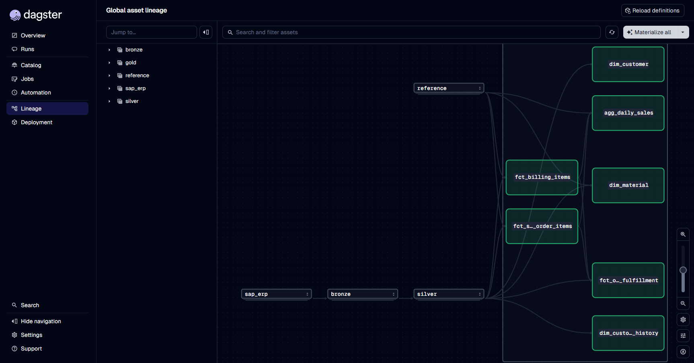
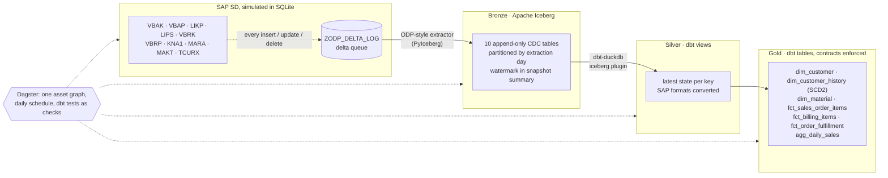

# SAP → Iceberg Lakehouse

> SAP Order-to-Cash data, extracted with change data capture into Apache Iceberg, modelled with dbt and orchestrated by Dagster. Runs on a laptop with one command.

[](https://github.com/pedro-mesquita7/sap-iceberg-lakehouse/actions/workflows/ci.yml)


[](LICENSE)

**[Browse the live dbt docs and lineage →](https://pedro-mesquita7.github.io/sap-iceberg-lakehouse/)** (rebuilt from scratch by CI every day)



## Why this exists

Getting data out of SAP is where most enterprise data platforms get messy. The tables are cryptic (`VBAK`, `VBAP`, `LIKP`), the data arrives in SAP's internal formats, and full reloads stop scaling after the first year. Change data capture is the answer, but it only works if deletes, re-runs and partial failures are handled properly.

This repository is a working reference implementation of that pipeline. It is built from patterns I use on real SAP extractions, on public tools, with a simulated SAP system so anyone can run it:

1. **A simulated SAP SD system** creates, changes, rejects, deletes, delivers and bills sales orders every business day. Every change is logged to an ODP-style delta queue.
2. **A CDC extractor** reads the delta queue and appends change events to **Apache Iceberg** tables. The extraction watermark is committed atomically in the same Iceberg snapshot as the data.
3. **dbt** turns the event log into clean current-state tables (silver) and a dimensional model with **enforced contracts** (gold), including SCD Type 2 history derived directly from the change events.
4. **Dagster** runs it all as one asset graph, with every dbt test showing up as an asset check.

## Quickstart

Requires [uv](https://docs.astral.sh/uv/). Everything runs locally: no cloud account, no Docker, no SAP licence.

```bash
git clone https://github.com/pedro-mesquita7/sap-iceberg-lakehouse.git
cd sap-iceberg-lakehouse
uv sync

# 30 days of SAP history -> initial load -> 5 daily delta runs -> dbt build with all tests
uv run sap-lakehouse demo

# Explore it in the Dagster UI (http://localhost:3000), then "Materialize all" to run a business day
uv run dagster dev
```

Other commands: `sap-lakehouse erp advance`, `sap-lakehouse extract`, `sap-lakehouse transform`, `sap-lakehouse snapshots vbak` (Iceberg time-travel history), `sap-lakehouse docs`.

## Architecture



| Layer | Technology | Holds |
|---|---|---|
| Source | SQLite, simulated SAP SD with an ODP-style delta queue | 10 SAP tables in SAP's internal formats |
| Bronze | Apache Iceberg (PyIceberg, SQL catalog) | Every change event, append-only, time-travel per load |
| Silver | dbt on DuckDB (views) | Current state per key, SAP formats converted |
| Gold | dbt on DuckDB (tables, contracts enforced) | Star schema, SCD2 history, order-to-cash cycle times |
| Orchestration | Dagster + dagster-dbt | 36 assets, 40 asset checks, daily schedule |
| CI/CD | GitHub Actions | Lint, tests, full pipeline run, docs published to Pages |

## SAP quirks handled

SAP delivers data in its internal formats. Each quirk below is handled in a tested dbt macro ([`dbt/macros/sap.sql`](dbt/macros/sap.sql)):

| Quirk | Raw value | After silver |
|---|---|---|
| ALPHA conversion: numeric keys are zero-padded, external keys are not | `0000100042`, `IC-PORTO` | `100042`, `IC-PORTO` |
| "No date" is `00000000` | `00000000` | `null` |
| Amounts are stored with 2 decimals whatever the currency (TCURX lists the exceptions) | JPY `150.00`, KWD `229207.60` | JPY `15000`, KWD `22920.760` |
| Negative numbers carry a trailing minus sign | `1250.50-` | `-1250.50` |
| Units and document types use internal German keys | `ST`, `KAR`, `TA` | `PC`, `CAR`, `OR` |
| Texts live in a separate table, one row per one-letter language key | `MAKT` with `E` / `D` / `P` | English name with fallback, DE and PT columns |
| Item amounts have no currency of their own | `VBRP-NETWR` | valued with the header's `VBRK-WAERK` |

## How the CDC works

The extractor ([`extract/odp.py`](src/sap_lakehouse/extract/odp.py)) follows ODP/SLT delta semantics:

- **Initial load, then deltas.** With no Iceberg snapshot, the table is fully loaded. After that, only keys logged in the delta queue since the last watermark are read.
- **Net change per key.** Several updates between runs become one event carrying the current row image. A row created and deleted between runs is skipped. A missing row becomes a delete event that carries only its key.
- **The watermark is stored in the Iceberg snapshot.** The new watermark is written to the snapshot summary in the same commit as the data (`sap.odp.watermark`). Data and progress cannot drift apart: a crash before the commit just means the window is read again.
- **The high-water mark is read before the data.** Anything that changes mid-extraction is delivered again next run. That is harmless because bronze is an event log and silver keeps the latest event per key (`_seq`).
- **Deletes propagate.** Silver drops keys whose latest event is a delete. SCD2 history closes the record at the delete time.

The guarantee this adds up to is tested directly. After any sequence of simulated days and extractions, replaying the bronze events reproduces **exactly** the contents of every SAP table ([`tests/test_extract.py`](tests/test_extract.py)).

## Data quality

| Check | Count | Where |
|---|---|---|
| dbt data tests (unique, not null, relationships, accepted values) | 40 | `dbt/models/**/_*.yml` |
| Reconciliation tests: billing headers equal the sum of their items, no order item billed beyond its ordered quantity | 2 | [`dbt/tests/`](dbt/tests) |
| dbt unit tests: CDC resolution and SAP formats, SCD2 versioning | 2 | [`_sap__models.yml`](dbt/models/staging/_sap__models.yml) |
| Enforced model contracts (column names and types) | every gold model | [`_marts.yml`](dbt/models/marts/_marts.yml) |
| pytest: simulator determinism, CDC semantics, bronze replay equals source | 11 | [`tests/`](tests) |

CI runs all of it on every push and every morning. The pipeline is rebuilt from nothing, and the dbt docs site is republished.

## Project structure

```
├── src/sap_lakehouse/
│   ├── erp/            # SAP table definitions + business-day simulator with delta queue
│   ├── extract/        # ODP-style CDC extractor -> Iceberg bronze
│   ├── orchestration/  # Dagster assets, dbt integration, schedule
│   ├── config.py       # lakehouse paths and Iceberg catalog
│   └── cli.py          # `sap-lakehouse` command
├── dbt/
│   ├── macros/sap.sql  # SAP format conversions + CDC current-state macro
│   ├── models/staging/ # silver: one model per SAP table, sources read exactly once
│   ├── models/marts/   # gold: dims and facts with enforced contracts
│   ├── seeds/          # SAP code tables (units, order types, languages, FX)
│   └── tests/          # reconciliation tests
├── tests/              # pytest
└── docs/adr/           # architecture decision records
```

## Design decisions

| # | Decision |
|---|---|
| [001](docs/adr/001-iceberg-bronze-as-event-log.md) | Bronze is an append-only CDC event log in Iceberg, not a mirror of the source |
| [002](docs/adr/002-watermark-in-snapshot-properties.md) | The extraction watermark lives in the Iceberg snapshot summary |
| [003](docs/adr/003-duckdb-for-transformations.md) | DuckDB as the dbt engine, with a warehouse swap kept to a config change |

## Taking it to production

Every local component has a direct production counterpart. The code and the models stay the same:

| Here | In production |
|---|---|
| SQLite SAP simulator + `ZODP_DELTA_LOG` | SAP ECC / S/4HANA via ODP (SAP CDC connectors, SLT or replication flows) |
| Iceberg SQL catalog on SQLite | AWS Glue, Polaris or any Iceberg REST catalog |
| Local warehouse directory | S3 / ADLS / GCS |
| dbt-duckdb | dbt on Athena, Trino, Snowflake or Databricks (the Iceberg tables stay where they are) |
| `dagster dev` | Dagster+ or a self-hosted Dagster deployment |
| Static FX rates seed | Daily rates from SAP `TCURR` |

---

Built by [Pedro Mesquita](https://pedro-mesquita7.github.io/pm-portfolio/), Senior Data Engineer, available for B2B contracts. [LinkedIn](https://www.linkedin.com/in/pedro-mesquita/)
